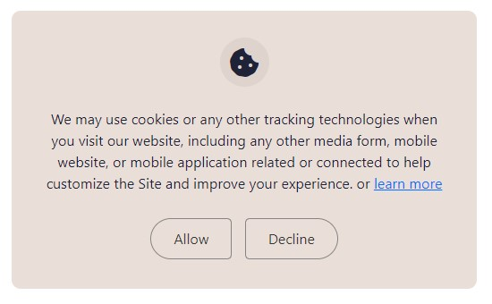
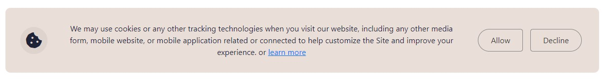
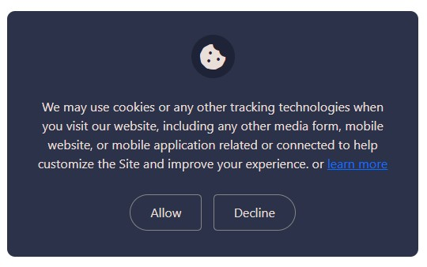
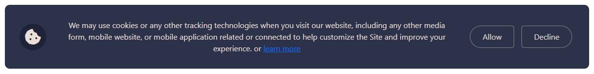

# Cookies design - by fahaddevs

**You are looking for cookies design for your website?**
This simple repo will help you.
Just download the repo and copy paste some lines of code.


### cookies default design
```html
  <!-- cookies default start -->
    <div class="cookies-card bg--default radius--10px text-center">
      <div class="cookies-card__icon">
        <i class="fas fa-cookie-bite"></i>
      </div>
      <p class="mt-4 cookies-card__content">We may use cookies or any other tracking technologies when you visit our website, including any other media form, mobile website, or mobile application related or connected to help customize the Site and improve your experience. or <a href="#0">learn more</a></p>
      <div class="cookies-card__btn mt-4">
        <a href="#0" class="cookies-btn left--btn">Allow</a>
        <a href="#0" class="cookies-btn right--btn">Decline</a>
      </div>
    </div>
  <!-- cookies default end -->
```

### Result 



### cookies large version design
*just add (style--lg) class*
```html
  <!-- cookies default start -->
    <div class="cookies-card bg--default radius--10px text-center style--lg">
      <div class="cookies-card__icon">
        <i class="fas fa-cookie-bite"></i>
      </div>
      <p class="cookies-card__content">We may use cookies or any other tracking technologies when you visit our website, including any other media form, mobile website, or mobile application related or connected to help customize the Site and improve your experience. or <a href="#0">learn more</a></p>
      <div class="cookies-card__btn">
        <a href="#0" class="cookies-btn left--btn">Allow</a>
        <a href="#0" class="cookies-btn right--btn">Decline</a>
      </div>
    </div>
  <!-- cookies default end -->
```

### Result 



### cookies dark version design
*just add (cookies--dark) class*
```html
  <!-- cookies dark version start -->
    <div class="cookies-card bg--default radius--10px text-center cookies--dark">
      <div class="cookies-card__icon">
        <i class="fas fa-cookie-bite"></i>
      </div>
      <p class="mt-4 cookies-card__content">We may use cookies or any other tracking technologies when you visit our website, including any other media form, mobile website, or mobile application related or connected to help customize the Site and improve your experience. or <a href="#0">learn more</a></p>
      <div class="cookies-card__btn mt-4">
        <a href="#0" class="cookies-btn left--btn">Allow</a>
        <a href="#0" class="cookies-btn right--btn">Decline</a>
      </div>
    </div>
  <!-- cookies dark version end -->
```

### Result 




Here is the [Demo link:](https://fahaddevs.github.io/cookies-design/)


---


##### If you're interested this project, Please contribute and hit the star button.

| Social Medias | Links                                                      |
| ------------- | ---------------------------------------------------------- |
| Facebook      | [Facebook Profile](https://www.facebook.com/fahaddevs)     |
| Linkedin      | [Linkedin Profile](https://www.linkedin.com/in/fahaddevs/) |
| Twitter       | [Twitter Profile](https://twitter.com/fahaddevs)           |
| Instagram     | [Instagram Profile](https://www.instagram.com/fahaddevs/)  |
| CodePen       | [CodePen Profile](https://codepen.io/fahaddevs/)           |